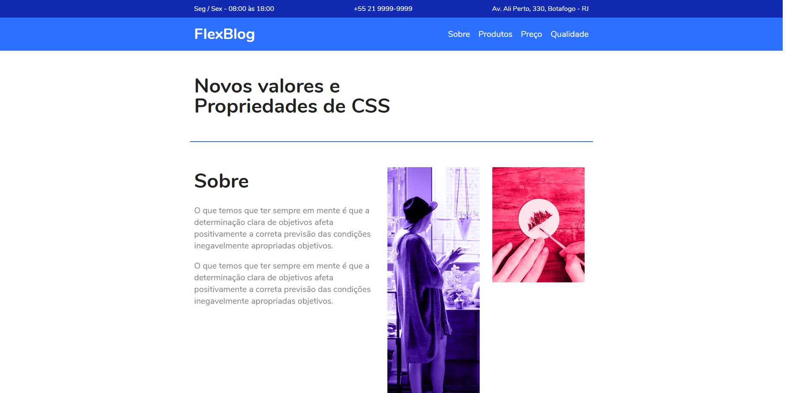

## Flexblog

## Preview
[Flexblog](https://flexblog-ten-swart.now.sh/src/index.html)
## Origamid  
[Origamid](https://www.origamid.com)  
Curso: [CSS Flexbox](https://www.origamid.com/curso/css-flexbox)
## Obs
A organização das pastas não segue a organização das pastas das aulas, já que foi usado ITCSS e RSCSS para testes nesse projeto.
